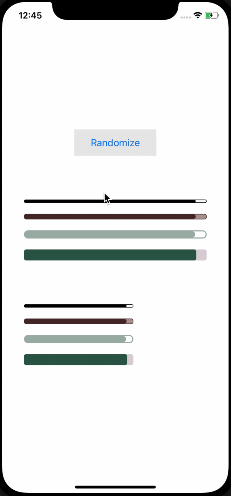

[](https://www.npmjs.com/package/react-native-progress-bar-horizontal)
[](https://opensource.org/licenses/MIT)

# react-native-progress-bar-horizontal

Simple, JavaScript only, horizontal progress bar.



## Installation

```sh
npm install react-native-progress-bar-horizontal
```

## Usage

```js
import ProgressBar from 'react-native-progress-bar-horizontal';

// Provide progress value
<ProgressBar progress={0.5} />

// Change default look
<ProgressBar
  progress={0.3}
  borderWidth={1}
  fillColor="#4C2C2E"
  unfilledColor="#AF9995"
  height={10}
  borderColor="#4C2C2E"
  duration={100}
/>
```

## Props

| Prop                | Type             | Description                                                                             | Default   |
| ------------------- | ---------------  | --------------------------------------------------------------------------------------- | --------- |
| **`progress`**      | `number`         | Value of progress. It should be a number between `0` and `1`.                           | `0`       |
| **`animated`**      | `boolean`        | Should progress change be animated of not.                                              | `true`    |
| **`fillColor`**     | `string`         | Fill color of the progress indicator.                                                   | `#000000` |
| **`unfilledColor`** | `string`         | Color of the remaining progress.                                                        | `''`      |
| **`borderWidth`**   | `number`         | Width of outer border. Set to `0` to remove border.                                     | `1`       |
| **`borderColor`**   | `string`         | Color of outer border.                                                                  | `#000000` |
| **`borderRadius`**  | `number`         | Border radius of outer border.                                                          | `4`       |
| **`width`**         | `number \| null` | Width of progress container. Set to `null` to use available space.                      | `null`    |
| **`height`**        | `number`         | Height of the progress bar.                                                             | `4`       |
| **`duration`**      | `number`         | Duration of progress animation in `ms`. Works only if `animated` prop is set to `true`. | `500`     |

## Contributing

See the [contributing guide](CONTRIBUTING.md) to learn how to contribute to the repository and the development workflow.

## License

MIT
